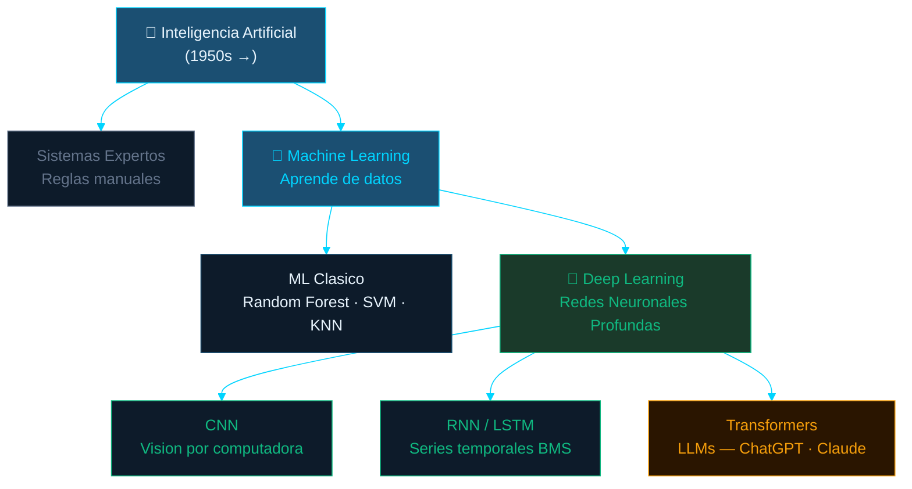
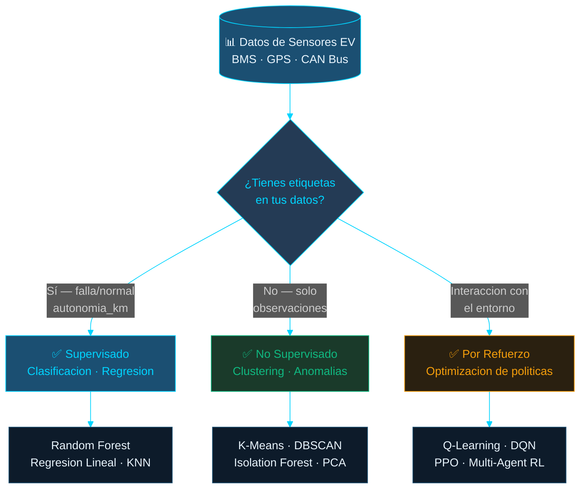
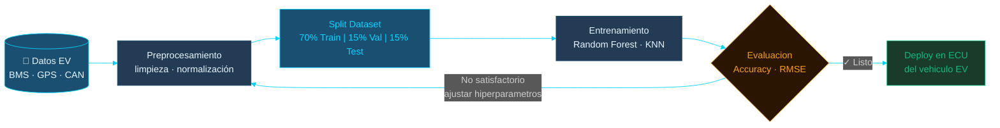
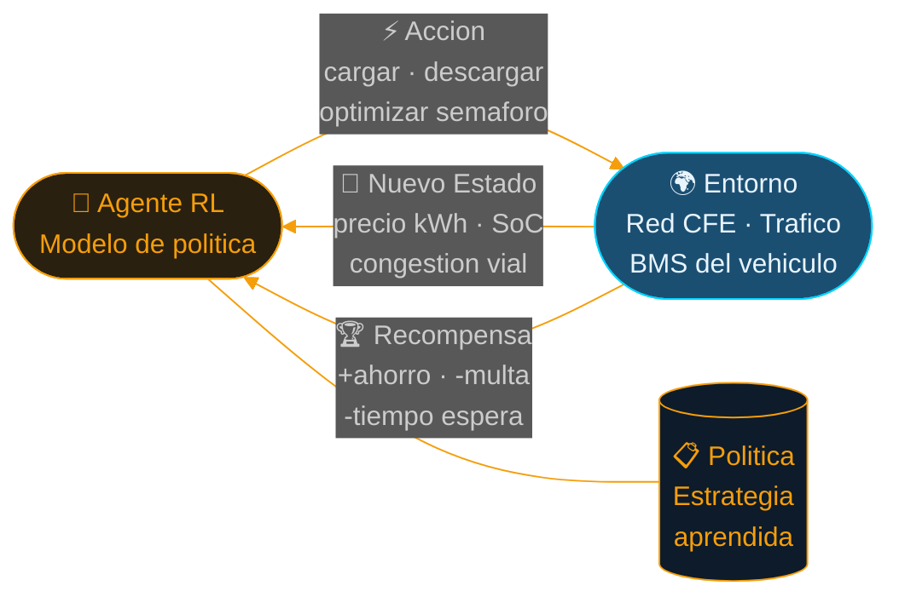

# Bloque 01
## Fundamentos de Machine Learning

Aplicado a la Electromovilidad — Ciudad Juárez, Chihuahua

2 horas | Teoria + Practica · UTCJ

  
  
  
  

---
layout: default
---

# Contenido del Bloque

  

    
Tipos de Aprendizaje

    
Supervisado, No Supervisado, Refuerzo

  

  

    
Dataset y Variables

    
Features, etiquetas, anatomia de un dataset

  

  

    
Metricas de Evaluacion

    
Accuracy, Precision, Recall, RMSE

  

  

    
Overfitting y Validacion

    
Train/Validation/Test split, generalizacion

  

  

    
Herramientas

    
Google Colab, Teachable Machines

  

  

    
PRACTICA

    
Entrenamiento no-code y analisis de metricas

  

---
layout: default
class: dark-slide
---

# ¿Qué es la Inteligencia Artificial?

  

    <mdi-robot class="text-3xl mb-3" />
    
Inteligencia Artificial

    
Sistemas que imitan capacidades humanas: razonar, aprender, percibir y tomar decisiones.

    
Ej: asistentes de voz, autos autónomos, diagnóstico médico

  

  

    <mdi-brain class="text-3xl mb-3" />
    
Machine Learning

    
Subconjunto de IA. El sistema aprende de datos sin ser programado explícitamente para cada tarea.

    
Ej: predecir fallas de batería, clasificar conductores

  

  

    <mdi-flask class="text-3xl mb-3" />
    
Deep Learning

    
Subconjunto de ML. Usa redes neuronales profundas con muchas capas para aprender representaciones complejas.

    
Ej: detección de peatones, reconocimiento de señales

  

  
IA

  
⊃

  
Machine Learning

  
⊃

  
Deep Learning

  
El DL es un tipo de ML, que a su vez es un tipo de IA

---
layout: default
class: dark-slide
---

# Mapa Conceptual — IA, ML y Deep Learning

---
layout: image-right
image: /img/b01-neural-network.jpg
class: dark-slide
---

# ¿Por qué NO usamos LLMs en Electromovilidad?

  
ChatGPT ✗

  
Gemini ✗

  
Claude ✗

  para control de hardware EV

  

    <mdi-timer class="text-2xl flex-shrink-0" />
    

      
Latencia inaceptable

      
BMS necesita decisiones en milisegundos. LLM tarda 1–10 seg — inaceptable en frenado regenerativo.

    

  

  

    <mdi-chart-bar class="text-2xl flex-shrink-0" />
    

      
Datos numéricos, no texto

      
EVs generan voltaje, corriente, temp, GPS. LLMs están hechos para lenguaje, no para series temporales de sensores.

    

  

  

    <mdi-laptop class="text-2xl flex-shrink-0" />
    

      
Costo computacional enorme

      
GPT-4: miles de GPUs A100. ECU embebida: recursos limitados. ML clásico corre en STM32 dentro del vehículo.

    

  

  

    <mdi-magnify class="text-2xl flex-shrink-0" />
    

      
Explicabilidad obligatoria

      
Norma ISO 26262 exige modelos auditables. LLMs son cajas negras — no certificables para seguridad automotriz.

    

  

---
layout: default
class: dark-slide
---

# Problemas Técnicos de los LLMs

  

    

      <mdi-emoticon-confused class="text-2xl" />
      

        

        

        

        

        

      

    

    
Alucinaciones

    
Inventa datos con confianza. Puede "reportar" SoC 87% cuando es 23%.

    
Crítico en seguridad

  

  

    

      <mdi-antenna class="text-2xl" />
      

        

        

        

        

        

      

    

    
Requiere conectividad

    
Sin señal en el desierto de Chihuahua → sin predicción.

    
Falla offline

  

  

    

      <mdi-lock class="text-2xl" />
      

        

        

        

        

        

      

    

    
Privacidad de datos

    
Rutas y hábitos de flota enviados a API externa. Datos IMMEX son confidenciales.

    
Riesgo legal

  

  

    

      <mdi-calculator class="text-2xl" />
      

        

        

        

        

        

      

    

    
Aritmética imprecisa

    
RF: RMSE ~8 km en autonomía. LLM: aproximaciones impredecibles.

    
Precisión no garantizada

  

  

    

      <mdi-lightning-bolt class="text-2xl" />
      

        

        

        

        

        

      

    

    
Consume demasiada energía

    
GPT-4: ~50 GWh de entrenamiento. Árbol de decisión: &lt;1W en ECU.

    
Contradice el EV

  

  

    

      <mdi-trending-down class="text-2xl" />
      

        

        

        

        

        

      

    

    
Sobreingeniería

    
5 variables de sensor → Random Forest supera al LLM en velocidad, costo y precisión.

    
Herramienta incorrecta

  

● = nivel de severidad del problema

---
layout: default
class: dark-slide
---

# LLMs vs ML Clásico — ¿Cuál usar en EV?

  
Criterio

  
<mdi-robot class="inline" /> LLM

  
<mdi-brain class="inline" /> ML Clásico

  
Ganador

  

    
<mdi-timer class="inline" /> Latencia

    
1–10 segundos

    
1–10 ms

    
ML ✓

  

  

    
<mdi-chart-bar class="inline" /> Tipo de datos

    
Texto / NLP

    
Tabular / sensores

    
ML ✓

  

  

    
<mdi-antenna class="inline" /> Offline

    
No — requiere nube

    
Sí — ECU local

    
ML ✓

  

  

    
<mdi-magnify class="inline" /> Explicabilidad

    
Caja negra

    
ISO 26262 ✓

    
ML ✓

  

  

    
<mdi-currency-usd class="inline" /> Costo

    
Alto — API $$$

    
Bajo — local

    
ML ✓

  

  

    
<mdi-target class="inline" /> Precisión

    
Alucinaciones

    
RMSE controlable

    
ML ✓

  

  Resultado: ML Clásico 6 — LLM 0 en aplicaciones EV críticas

---
layout: image-right
image: /img/b01-ai-brain.jpg
class: dark-slide
---

# ¿Cuándo SÍ tienen sentido los LLMs?

  Casos válidos: soporte y gestión, nunca control de hardware crítico

  

    <mdi-chat class="text-2xl flex-shrink-0" />
    

      
Asistente de flota para operadores

      
"¿Cuál unidad tiene mayor riesgo hoy?" → LLM interpreta → consulta dashboard ML → responde en lenguaje natural.

      
Interfaz NLP → ML

    

  

  

    <mdi-clipboard-list class="text-2xl flex-shrink-0" />
    

      
Generación de reportes técnicos

      
Modelo ML detecta anomalía → LLM redacta el reporte en español para el técnico de Foxconn Juárez.

      
Post-procesamiento

    

  

  

    <mdi-school class="text-2xl flex-shrink-0" />
    

      
Capacitación de conductores

      
Chatbot sobre carga nocturna CFE y manejo eficiente en calor extremo (45°C verano Juárez).

      
Educación

    

  

  

    <mdi-wrench class="text-2xl flex-shrink-0" />
    

      
RAG sobre manuales técnicos

      
Consulta instantánea de manuales BYD, Nissan Leaf, VW ID.4 sin revisar 500+ páginas manualmente.

      
Recuperación info

    

  

  <mdi-key class="inline" /> El LLM habla con el humano — el modelo ML habla con el hardware

---
layout: default
class: dark-slide
---

# Tipos de Aprendizaje en Machine Learning

  

    <mdi-school class="text-3xl mb-2" />
    
Supervisado

    
Aprende con datos etiquetados

    
ETIQUETADO

  

  

    <mdi-magnify class="text-3xl mb-2" />
    
No Supervisado

    
Encuentra patrones sin etiquetas

    
SIN ETIQUETAS

  

  

    <mdi-gamepad-variant class="text-3xl mb-2" />
    
Por Refuerzo

    
Aprende por recompensas

    
RECOMPENSA

  

Veamos cada uno en detalle →

---
layout: default
class: dark-slide
---

# ¿Qué paradigma ML usar en tu proyecto EV?

---
layout: default
class: dark-slide
---

# <mdi-school class="inline" /> Aprendizaje Supervisado

  

    
¿Como funciona?

    

      El modelo recibe datos de entrada (X) junto con la
      respuesta correcta (Y). Aprende la relacion entre ambos
      para predecir Y en datos nuevos.
    

    

      
<mdi-download class="inline" /> Entrada (X)

      temperatura, voltaje, corriente, km recorridos
    

    

      
<mdi-upload class="inline" /> Salida (Y)

      falla / normal, autonomia_km, SoC %
    

  

  

    
<mdi-calculator class="inline" /> Algoritmos Principales

    

      

        Regresion Lineal — Predice valores continuos 
        Ej: predecir autonomia restante en km
      

      

        Regresion Logistica — Clasifica en 2 categorias 
        Ej: bateria falla SI / NO
      

      

        Arboles de Decision — Reglas tipo if/else 
        Ej: si temp > 40°C y ciclos > 500 → riesgo alto
      

      

        Random Forest — Multiples arboles votando 
        Ej: clasificar tipo de manejo (suave/normal/agresivo)
      

      

        KNN (K-Nearest Neighbors) — Clasifica por vecinos cercanos 
        Ej: identificar tipo de vehiculo por patrones de carga
      

    

  

---
layout: default
class: dark-slide
---

# Pipeline de Entrenamiento Supervisado

---
layout: default
class: dark-slide
---

# <mdi-school class="inline" /> Supervisado — Ejemplos en Electromovilidad

  

    

      <mdi-battery class="text-xl" />
      

        
Prediccion de fallas en celdas — Foxconn Juárez

        
Random Forest analiza voltaje, corriente y temperatura para predecir si una celda fallará en las proximas 24 horas.

        

          Clasificacion
          Random Forest
          Accuracy: ~95%
        

      

    

  

  

    

      <mdi-car-electric class="text-xl" />
      

        
Estimacion de autonomia en desierto de Chihuahua

        
Regresion lineal con temperatura exterior (45°C verano), AC, velocidad y pendiente para estimar km restantes.

        

          Regresion
          Regresion Lineal
          RMSE: ~8 km
        

      

    

  

  

    

      <mdi-lightning-bolt class="text-xl" />
      

        
Clasificacion de estilo de manejo — Blvd. Zaragoza

        
Arbol de decision analiza aceleracion, frenado y velocidad promedio para clasificar conductor: suave / normal / agresivo.

        

          Clasificacion
          Arbol de Decision
          3 clases
        

      

    

  

  

    

      <mdi-power-plug class="text-xl" />
      

        
Prediccion de SoC al llegar al cruce fronterizo

        
KNN estima el SoC para la espera en Puente Zaragoza (1-3 hrs con AC) más el tramo freeway en El Paso.

        

          Regresion
          KNN
          SoC %
        

      

    

  

---
layout: default
class: dark-slide
---

# <mdi-magnify class="inline" /> Aprendizaje No Supervisado

  

    
¿Como funciona?

    

      El modelo recibe solo datos de entrada (X),
      sin respuestas correctas.
      El algoritmo descubre patrones, grupos o anomalias por si mismo.
    

    

      
<mdi-download class="inline" /> Entrada (X)

      velocidad, aceleracion, hora de carga, consumo kWh, ruta GPS
    

    

      
<mdi-close-circle class="inline" /> NO hay salida (Y)

      El modelo descubre la estructura oculta en los datos
    

  

  

    
<mdi-calculator class="inline" /> Algoritmos Principales

    

      

        K-Means — Agrupa datos en K clusters 
        Ej: agrupar conductores por perfil de manejo
      

      

        DBSCAN — Clusters por densidad 
        Ej: detectar zonas con alta demanda de carga en Juárez
      

      

        PCA — Reduce dimensiones de datos 
        Ej: simplificar 50 sensores CAN Bus a las 5 variables clave
      

      

        Isolation Forest — Detecta anomalias 
        Ej: detectar cargas anormales en una flota nocturna
      

      

        Autoencoders — Red neuronal para anomalias 
        Ej: detectar degradacion temprana en packs de baterias
      

    

  

---
layout: default
class: dark-slide
---

# <mdi-magnify class="inline" /> No Supervisado — Ejemplos en Electromovilidad

  

    

      <mdi-account-group class="text-xl" />
      

        
Segmentacion de conductores — Corredor IMMEX

        
K-Means agrupa 200 conductores en 4 perfiles (economico, normal, agresivo, variable) para adaptar alertas por grupo.

        

          Clustering
          K-Means
          4 clusters
        

      

    

  

  

    

      <mdi-alarm-light class="text-xl" />
      

        
Deteccion de anomalias en carga nocturna

        
Isolation Forest detecta si una unidad carga 40% mas lento que lo habitual y genera alerta de degradacion.

        

          Anomalias
          Isolation Forest
          Sin etiquetas
        

      

    

  

  

    

      <mdi-map class="text-xl" />
      

        
Segmentacion de rutas Juárez–El Paso

        
DBSCAN descubre perfiles distintos entre rutas: Puente Libre vs Puente Zaragoza tienen consumo, distancia y tiempo completamente diferentes.

        

          Clustering
          DBSCAN
          Rutas GPS
        

      

    

  

  

    

      <mdi-trending-down class="text-xl" />
      

        
Reduccion de datos CAN Bus — Continental Juárez

        
PCA reduce 50+ señales del CAN Bus a 5-7 componentes que explican el 95% de la varianza, simplificando el monitoreo.

        

          Reduccion
          PCA
          50 → 5 variables
        

      

    

  

---
layout: default
class: dark-slide
---

# <mdi-gamepad-variant class="inline" /> Aprendizaje por Refuerzo

  

    
¿Como funciona?

    

      Un agente interactua con un
      entorno, toma
      acciones y recibe
      recompensas o penalizaciones.
      Aprende la mejor estrategia por prueba y error.
    

    

      

        

          <mdi-robot class="inline" /> Agente:
          El que toma decisiones
        

        

          <mdi-earth class="inline" /> Entorno:
          El mundo donde opera
        

        

          <mdi-lightning-bolt class="inline" /> Accion:
          Lo que hace en cada paso
        

        

          <mdi-trophy class="inline" /> Recompensa:
          +1 si fue buena, -1 si no
        

        

          <mdi-clipboard-list class="inline" /> Politica:
          La estrategia aprendida
        

      

    

  

  

    
<mdi-calculator class="inline" /> Algoritmos Principales

    

      

        Q-Learning — Tabla de valores por estado-accion 
        Ej: aprender mejor ruta en un grid de calles
      

      

        Deep Q-Network (DQN) — Q-Learning + red neuronal 
        Ej: control de semáforos con miles de estados posibles
      

      

        PPO — Policy Optimization estable 
        Ej: conduccion autonoma (usado por Tesla, Waymo)
      

      

        SARSA — Aprende de la accion que realmente toma 
        Ej: gestion conservadora de energia en bateria
      

      

        Multi-Agent RL — Multiples agentes cooperando 
        Ej: coordinar carga de 50 EVs en un parque industrial
      

    

  

---
layout: default
class: dark-slide
---

# Ciclo del Agente de Aprendizaje por Refuerzo

El agente mejora su política iterativamente — con cada episodio aprende a maximizar la recompensa acumulada

---
layout: default
class: dark-slide
---

# <mdi-gamepad-variant class="inline" /> Por Refuerzo — Ejemplos en Electromovilidad

  

    

      <mdi-traffic-light class="text-xl" />
      

        
Optimizacion de semáforos — Tecnologico y Zaragoza

        
DQN controla ciclos de semáforos. Recompensa: reducir espera. Penalizacion: congestion o alto consumo de EVs frenando/arrancando.

        

          Optimizacion
          DQN
          -20% espera
        

      

    

  

  

    

      <mdi-lightning-bolt class="text-xl" />
      

        
Gestion de carga V2G — Horario pico CFE

        
PPO decide cuándo cargar y cuándo devolver energía. Aprovecha tarifa baja nocturna y vende en hora pico para maximizar ahorro.

        

          Energia
          PPO
          V2G Bidireccional
        

      

    

  

  

    

      <mdi-taxi class="text-xl" />
      

        
Ruteo de taxis electricos — Ciudad Juárez

        
Q-Learning evita topes, subidas y cruces con frenado intenso. Recompensa: maximizar km por kWh consumido.

        

          Ruteo
          Q-Learning
          Min energia
        

      

    

  

  

    

      <mdi-factory class="text-xl" />
      

        
Coordinacion de carga — Parque Industrial Bermúdez

        
Multi-Agent RL coordina 50 EVs para no exceder el límite de la subestacion CFE. Cada EV negocia su turno de carga.

        

          Coordinacion
          Multi-Agent RL
          50 agentes
        

      

    

  

---
layout: image-right
image: /img/b01-analytics.jpg
---

# Tipos de Problemas en ML

  

    

      

      Clasificacion
    

    
El modelo predice una categoria Ejemplo: falla / normal en celda de bateria

  

  

    

      

      Regresion
    

    
El modelo predice un valor numerico Ejemplo: autonomia restante en km

  

  

    

      

      Optimizacion
    

    
El modelo encuentra la mejor solucion Ejemplo: ruta optima con menos energia

  

---
layout: default
class: dark-slide
---

# Variable Dependiente vs Variable Independiente

  

    

      

        
X

        

          
Variables Independientes

          
Tambien llamadas: Features, Entrada, Predictores

        

      

      
Son los datos que le damos al modelo para que aprenda. No dependen del modelo, existen por si solos.

      

        
<mdi-antenna class="inline" /> Datos de sensores: temperatura, voltaje, corriente

        
<mdi-map-marker class="inline" /> Datos GPS: velocidad, altitud, distancia

        
<mdi-wrench class="inline" /> Datos operativos: ciclos de carga, horas de uso

        
<mdi-thermometer class="inline" /> Datos ambientales: clima, hora del dia, trafico

      

    

  

  

    

      

        
Y

        

          
Variable Dependiente

          
Tambien llamada: Etiqueta, Target, Salida

        

      

      
Es la respuesta que queremos predecir. Depende de las variables X — por eso se llama "dependiente".

      

        
<mdi-tag class="inline" /> Clasificacion: falla/normal, suave/agresivo

        
<mdi-ruler class="inline" /> Regresion: autonomia_km, SoC%, kW demanda

        
<mdi-check-circle class="inline" /> Binaria: si/no, verdadero/falso

        
<mdi-target class="inline" /> Multiclase: tipo_A / tipo_B / tipo_C

      

    

  

  

    X
    →
    <mdi-brain class="inline" /> Modelo ML
    →
    Y
  

  
"X entra al modelo — Y es lo que predice"

---
layout: default
class: dark-slide
---

# Variable Dependiente vs Independiente — Ejemplos EV

Casos reales de electromovilidad en Ciudad Juárez

| Problema — Juárez | Variables X (entrada) | Variable Y (salida) | Tipo |
|---|---|---|---|
| Autonomia en desierto de Chihuahua | temp exterior (40°C verano), AC, velocidad | km restantes | Regresion |
| Falla en celda — flota maquiladora | voltaje, corriente, temp batería, ciclos | falla / normal | Clasificacion |
| SoC en cruce fronterizo | voltaje OCV, corriente, historial del turno | SoC % al llegar | Regresion |
| Tipo de manejo en Blvd. Zaragoza | aceleración, frenado por topes, velocidad | suave / agresivo / normal | Clasificacion |
| Demanda de carga — Parque Industrial | hora, turno (1°/2°/3°), temp, día festivo | kW demandados a CFE | Regresion |

  
<mdi-lightbulb class="inline" /> ¿Como saber cual es X y cual es Y?

  

    

      Preguntate: ¿Que quiero predecir? 
      → Eso es Y (variable dependiente)
    

    

      Preguntate: ¿Con que datos cuento? 
      → Eso son las X (variables independientes)
    

  

---
layout: default
class: dark-slide
---

# Tipos de Variables en un Dataset

  

    

      

      Numérica Continua
    

    
Cualquier valor, incluye decimales

    

      
<mdi-thermometer class="inline" /> Temperatura: 38.5°C

      
<mdi-lightning-bolt class="inline" /> Voltaje: 3.72V

      
<mdi-car-electric class="inline" /> Velocidad: 67.3 km/h

      
<mdi-battery class="inline" /> SoC: 78.4%

    

  

  

    

      

      Numérica Discreta
    

    
Enteros contables, sin decimales

    

      
<mdi-refresh class="inline" /> Ciclos de carga: 150, 500

      
<mdi-car-electric class="inline" /> Pasajeros: 1, 2, 4

      
<mdi-wrench class="inline" /> Fallas: 0, 1, 3

      
<mdi-chart-bar class="inline" /> Celdas: 96

    

  

  

    

      

      Categórica Nominal
    

    
Categorías sin orden

    

      
<mdi-car-electric class="inline" /> Marca: Tesla, BYD, VW

      
<mdi-road class="inline" /> Ruta: Zaragoza, Córdoba

      
<mdi-factory class="inline" /> Planta: Foxconn, Bosch

      
<mdi-lightning-bolt class="inline" /> Conector: CCS, CHAdeMO

    

  

  

    

      

      Categórica Ordinal
    

    
Categorías CON jerarquía

    

      
<mdi-battery class="inline" /> Carga: bajo→medio→alto

      
<mdi-alert class="inline" /> Riesgo: bajo→moderado→crítico

      
<mdi-car-electric class="inline" /> Manejo: suave→agresivo

      
<mdi-chart-bar class="inline" /> SoH: excelente→EOL

    

  

  

    

      

      Booleana
    

    
Solo 2 valores posibles

    

      
<mdi-check-circle class="inline" /> Falla: SI / NO

      
<mdi-power-plug class="inline" /> Cargando: true / false

      
<mdi-car-electric class="inline" /> AC encendido: 1 / 0

      
<mdi-factory class="inline" /> Día festivo: SI / NO

    

  

  

    

      

      Temporal
    

    
Fechas y horas

    

      
<mdi-calendar class="inline" /> Fecha: 2026-03-13

      
<mdi-clock-outline class="inline" /> Hora pico CFE: 14-20h

      
<mdi-timer class="inline" /> Duración: 45 min

      
<mdi-chart-bar class="inline" /> Turno: 1° / 2° / 3°

    

  

---
layout: default
---

# Anatomia de un Dataset

  

    <mdi-clipboard-list class="text-xl mb-2" />
    
Variables de Entrada (Features)

    

      
temperatura (°C)

      
velocidad (km/h)

      
carga bateria (%)

      
km recorridos

    

  

  

    
→

    

      <mdi-brain class="text-xl mb-2" />
      
Modelo ML

      
Aprende patrones entre entrada y salida

    

    
→

  

  

    <mdi-tag class="text-xl mb-2" />
    
Variable de Salida (Etiqueta)

    

      
falla / normal

      
autonomia_km

      
ruta_optima

    

  

  En electromovilidad los datos provienen de sensores, BMS, GPS y CAN Bus

---
layout: default
class: dark-slide
---

# Overfitting, Validacion y Particion de Datos

  

    
ENTRENAMIENTO 70%

    
VALIDACION 15%

    
PRUEBA 15%

  

  

    
<mdi-arrow-down class="inline" /> Underfitting

    
El modelo es demasiado simple — no aprende los patrones reales

    
<mdi-arrow-up class="inline" /> Overfitting

    
El modelo memoriza el entrenamiento — falla con datos nuevos

  

  

    
✓ Balance Optimo

    
Generaliza bien en datos nuevos — esto es lo que buscamos

    

      En EV: un modelo sobreajustado podria predecir mal la autonomia en condiciones reales
    

  

---
layout: image-right
image: /img/b01-matrix.jpg
---

# Metricas de Evaluacion

  

    
<mdi-target class="inline" /> Accuracy

    
(VP + VN) / Total

    
Clasificacion balanceada

  

  

    
<mdi-scale-balance class="inline" /> Precision / Recall

    
Precision: de los que predije positivo, cuantos lo eran

    
Recall: de los positivos reales, cuantos detecte

  

  

    
<mdi-ruler class="inline" /> RMSE

    
Raiz del error cuadratico medio

    
Modelos de regresion (SoC, autonomia)

  

  

    
<mdi-lightbulb class="inline" /> Guia de Seleccion

    

      
Clasificacion → Accuracy + Precision

      
Regresion → RMSE + MAE

      
Deteccion → Precision + Recall

    

  

---
layout: default
class: dark-slide
---

# Casos Reales de IA en Electromovilidad

  

    
Tesla Autopilot

    
CNN + 8 cámaras 360°. Reto en Juárez: polvo del desierto y sol directo en Libramiento Aeropuerto

  

  

    
BYD — Batería

    
LSTM 97% precisión en SoH. Baterías degradan más rápido con 40°C+ del verano juarense

  

  

    
Google Maps EV

    
Optimiza ruta según autonomía. Caso: Bermúdez → Puente Córdoba (35 km, 2 estaciones)

  

  

    
VW / Continental Juárez

    
Mantenimiento predictivo en ensamble. Planta en Juárez con sensores IoT en producción

  

  

    
Taxis UTCJ

    
Flota 10 taxis eléctricos con ML: carga según turnos de la universidad y tarifa CFE nocturna

  

  

    
Reto Juárez–El Paso

    
Predecir SoC para esperar en Puente Zaragoza (1-3h) + tramo en El Paso (freeway)

  

---
layout: default
class: dark-slide
---

# Entorno de Practica

  

    <mdi-circle-outline class="text-2xl mb-2" />
    
Google Colab

    <ul class="text-sm space-y-1">
      <li>Entorno Python en la nube</li>
      <li>GPUs gratuitas disponibles</li>
      <li>Librerias ML preinstaladas</li>
      <li>Colaboracion en tiempo real</li>
    </ul>
    
colab.research.google.com

  

  

    <mdi-robot class="text-2xl mb-2" />
    
Teachable Machines

    <ul class="text-sm space-y-1">
      <li>ML visual sin codigo</li>
      <li>Clasificacion de imagenes</li>
      <li>Modelos exportables</li>
      <li>Ideal para primer acercamiento</li>
    </ul>
    
teachablemachine.withgoogle.com

  

Ambas plataformas son gratuitas y funcionan desde el navegador

---
layout: image-right
image: /img/b01-analytics.jpg
class: dark-slide
---

# Practica — Bloque 01

PRACTICA

## Entrenamiento No-Code y Analisis de Metricas

  

    
1

    
Acceder a Google Teachable Machines en el navegador

  

  

    
2

    
Cargar imagenes de autos electricos vs combustion (15-20 por clase)

  

  

    
3

    
Entrenar el modelo clasificador con los datos subidos

  

  

    
4

    
Evaluar Accuracy, Precision y Recall en el panel de metricas

  

  

    
5

    
Exportar modelo y discutir resultados en grupo

  

  
Google Teachable Machines

  
Google Colab (cuaderno de analisis)

---
layout: default
---

# Recursos — Bloque 01

  

    
<mdi-television class="inline" /> YouTube — Canales recomendados

    

      <a href="https://www.youtube.com/@DotCSV" target="_blank" class="card-ev p-3 flex items-start gap-3 no-underline block">
        
▶

        

          
DotCSV — Carlos Santana

          
ML e IA explicado en español. Buscar: "¿Qué es el Machine Learning?"

        

      </a>
      <a href="https://www.youtube.com/@machinelearnear" target="_blank" class="card-ev p-3 flex items-start gap-3 no-underline block">
        
▶

        

          
Machinelearnear

          
Tutoriales paso a paso de modelos ML en español. Buscar: "Clasificacion con Python"

        

      </a>
      <a href="https://www.youtube.com/@EDteam" target="_blank" class="card-ev p-3 flex items-start gap-3 no-underline block">
        
▶

        

          
EDTeam

          
Introduccion a IA y ML en español. Buscar: "Machine Learning desde cero"

        

      </a>
    

  

  

    
<mdi-link class="inline" /> Links de Practica y Estudio

    

      <a href="https://teachablemachine.withgoogle.com" target="_blank" class="card-ev p-3 flex items-center gap-3 no-underline block">
        <mdi-robot class="text-xl" />
        

          
Teachable Machine

          
ML sin codigo — clasifica imagenes en minutos

        

      </a>
      
      <a href="https://developers.google.com/machine-learning/crash-course?hl=es" target="_blank" class="card-ev p-3 flex items-center gap-3 no-underline block">
        <mdi-book class="text-xl" />
        

          
Google ML Crash Course

          
Curso gratuito de ML de Google — disponible en español

        

      </a>
      <a href="https://www.kaggle.com/datasets/urvishahir/electric-vehicle-specifications-dataset-2025" target="_blank" class="card-ev p-3 flex items-center gap-3 no-underline block">
        <mdi-chart-bar class="text-xl" />
        

          
Kaggle — EV Specs Dataset 2025

          
Dataset de especificaciones de EVs para practicar

        

      </a>
      <a href="https://www.aprendemachinelearning.com" target="_blank" class="card-ev p-3 flex items-center gap-3 no-underline block">
        <mdi-web class="text-xl" />
        

          
AprendeMachineLearning.com

          
Blog y ejercicios de ML en español con Python

        

      </a>
    

  

---
layout: center
class: dark-slide
---

# Puntos Clave — Bloque 01

  

    ✓
    Existen 3 paradigmas de ML: supervisado, no supervisado y refuerzo
  

  

    ✓
    Los problemas en electromovilidad son clasificacion, regresion y optimizacion
  

  

    ✓
    Un dataset tiene features (X, entrada) y etiquetas (Y, salida)
  

  

    ✓
    El overfitting ocurre cuando el modelo memoriza en lugar de generalizar
  

  

    ✓
    Las metricas nos dicen que tan bien generaliza nuestro modelo
  

  > Siguiente: Bloque 02 — Percepcion del Entorno y Computer Vision

